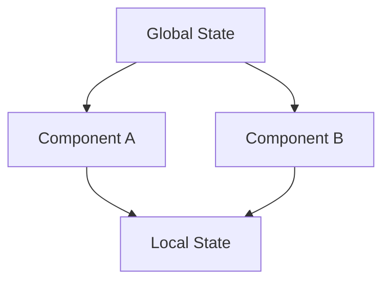

# State Management Solution Documentation for React App

## Table of Contents

1. [Executive Summary](#executive-summary)
2. [Overview and Objectives](#overview-and-objectives)
3. [Detailed Requirements](#detailed-requirements)
4. [Implementation Plan](#implementation-plan)
5. [Technical Specifications](#technical-specifications)
6. [Usage Guidelines](#usage-guidelines)
7. [Maintenance and Support](#maintenance-and-support)
8. [Appendices](#appendices)

---

## Executive Summary

This document outlines the design and implementation of a state management solution for a React application. The chosen solution aims to enhance the app's scalability, performance, and developer usability. It covers the selection of appropriate libraries, architectural design, integration, testing, and documentation to ensure a seamless transition and enhanced application robustness.

---

## Overview and Objectives

### Overview

As part of the ongoing development of our React application, a robust state management solution is required to handle increasing complexity and ensure efficient data flow. This solution must integrate well with the existing architecture and provide a scalable foundation for future growth.

### Objectives

- Select a state management solution that offers optimal performance and scalability.
- Ensure compatibility and ease of integration with existing components.
- Provide clear documentation and training resources for developers.
- Optimize the application's performance to maintain a smooth user experience.

---

## Detailed Requirements

1. **Compatibility**: The solution must seamlessly integrate with the existing React architecture.
2. **Scalability**: It should accommodate future growth and additional features.
3. **Ease of Integration**: The solution should be straightforward to implement with existing components.
4. **Performance Optimization**: It must ensure efficient rendering and data updates.
5. **Documentation**: Comprehensive guides and training materials are required for developer onboarding.

---

## Implementation Plan

### Overview

The implementation plan details the steps necessary to evaluate, select, and integrate a state management solution into the React app, ensuring alignment with current architecture and future scalability.

### Prerequisites and Dependencies

- **Architecture Compatibility**: Verify the solution's compatibility with the existing structure.
- **Library Knowledge**: Familiarity with Redux, MobX, Context API, and Zustand.
- **Development Environment**: Ensure readiness for additional library support.
- **Component Analysis**: Understand existing component interactions.

### Detailed Implementation Steps

#### Step 1: Research & Selection

1. **Evaluate Libraries**
   - List and evaluate Redux, MobX, Context API, Zustand.
   - Assess scalability, ease of use, performance, and integration.
   - Review documentation and community feedback.

2. **Select Solution**
   - Choose the best-fitting library or combination of libraries.

#### Step 2: Architecture Design

3. **Define State Structure**
   - Map current and future state needs.
   - Design a comprehensive state structure.

4. **Plan Data Flow**
   - Define data dispatch and consumption processes.
   - Minimize state propagation to prevent bottlenecks.

#### Step 3: Implementation

5. **Integrate State Management Solution**
   - Set up the library within the React app.
   - Establish global and local state management.

6. **Component Refactoring**
   - Connect components to the new state management.
   - Ensure components subscribe and update as necessary.

#### Step 4: Testing & Optimization

7. **Test Integration**
   - Conduct thorough performance and stability testing.

8. **Optimize Performance**
   - Implement memoization and performance optimizations.

#### Step 5: Documentation & Training

9. **Create Documentation**
   - Develop guides with architectural diagrams and code snippets.

10. **Provide Training Resources**
    - Offer onboarding sessions and share best practices.

### Milestones and Checkpoints

- **Milestone 1**: Selection of state management solution (1 week)
- **Milestone 2**: Architecture design completion (2 weeks)
- **Milestone 3**: Full integration and component refactoring (3 weeks)
- **Milestone 4**: Successful testing and optimization (1 week)
- **Milestone 5**: Finalized documentation and training (1 week)

### Success Criteria

- Seamless integration with current architecture
- Improved performance and reduced re-renders
- Comprehensive and accessible documentation
- Positive developer feedback

### Risk Assessment and Mitigation

- **Incompatibility**: Conduct compatibility checks pre-integration.
- **Performance Degradation**: Continuous testing and optimization.
- **Developer Resistance**: Provide thorough training and support.

---

## Technical Specifications

### Selected Solution

- **Library**: [Selected library based on evaluation]
- **Integration Points**: Global state setup, component connections
- **Data Flow**: Centralized state management, efficient dispatch

### Architecture Diagrams

---

## Usage Guidelines

- **State Management**: Follow defined state structures and flow.
- **Component Interaction**: Ensure components subscribe to necessary state changes.
- **Best Practices**: Use memoization, minimize re-renders.

---

## Maintenance and Support

- **Regular Updates**: Keep libraries up-to-date with the latest versions.
- **Ongoing Training**: Periodic training sessions for developers.
- **Support Resources**: Access to documentation and community forums.

---

## Appendices

### Appendix A: Library Evaluation Matrix

| Library    | Scalability | Ease of Use | Performance | Community Support |
|------------|-------------|-------------|-------------|-------------------|
| Redux      | High        | Medium      | High        | Strong            |
| MobX       | Medium      | High        | Medium      | Moderate          |
| Context API| Medium      | High        | High        | Limited           |
| Zustand    | High        | High        | High        | Growing           |

---

This document provides a comprehensive guide for implementing a state management solution in a React application, ensuring scalability, performance, and developer usability.